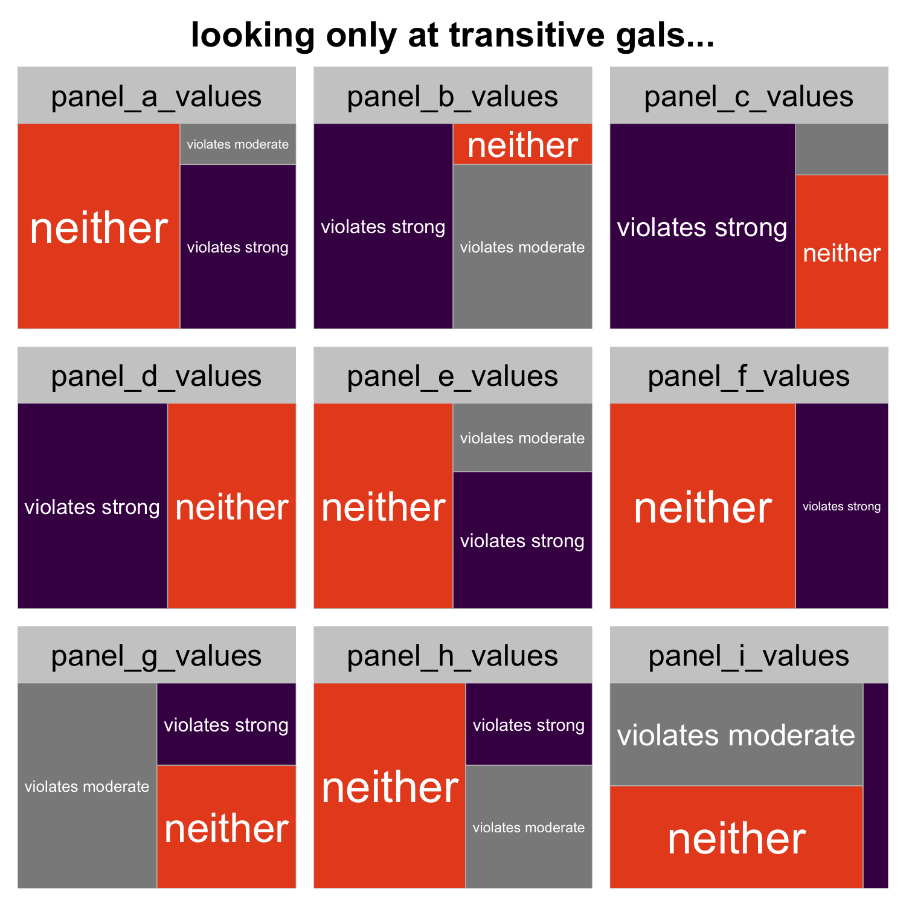

## issues in the study of transitivity of preference in animals

Recent years have seen an increase in the number of studies studying whether choice behavior in animals is rational, i.e., whether an animals' choice can be described with a function. Rational animals should be able to rank options with a consistent order, or be transitive in their choices. I identify several potential pitfalls and areas where future authors might explore when testing whether animals are transitive in their preferences. I illustrate many of these points by re-analyzing a dataset on transitivity of preference in crickets. I conclude by suggesting that the study of transitivity of preferences in animals has been crude and there is much to do.

I argue that animal (in)transitivities must be studied at the level of the individual to be meaningful. Once we adopt an individual perspective on rational decision-making, we allow for several new exciting questions.

## Introduction

### what is rationality, what is transitivity

Choices are the most elemental building blocks of behavior. Simple choices are the atoms and the quarks of behavior; they are the most basic, elementary phenomena we study to tell us something about behavior. And yet we lack a thorough understanding of the rules animals use to make very simple choices. Instead, we often rely on making simplifying assumptions about how animals choose. This article explores one of those common assumptions: that animals make choices by ranking things and choosing the option with the highest value on that scale. This is what is meant by _rational_ choice. 

Rational choice has two primary features. First, if an animal chooses rationally, then its relative preference for two options should not change in the presence of a third option. If it does, then it can be shown mathematically that the chooser is not strictly rational, that is, that the chooser is not maximzing some function. The finding that both humans and animals frequently fail this test is known as the _decoy effect_, as the third option in such a test is usually called a decoy. 

But arguably the more fundamental property of a rational decision-maker is that she chooses transitively: in the weakest possible sense (see below), what this means is that an animal can rank her options. Intransitivities are pervasive in biology: [examples in Larid and Shump Am Nat paper]. Species can show intransitive patterns of competition. Sperm compeition can be intransitive. Yet the role they might play in mate choice has rarely been studied.

The most common and intuitive way to test for transitive preferences is with a round-robin-like tournement, the likes of which have been studied intensiely by mathematitions for decades. In this sort of test, each option is presented with every other option. For example, for three choices, named A, B, C, a convention I will stick to throughout the paper, A is paired with B in one choice test and with C in a second choice test. The third choice pairs B and C. Though intuitively quite simple, the approach is powerful and allows one to examine whether an animal is capable of ranking options in the way needed to fulfill the basic tenants of sexual selection theory. 

Better intro sentence. An animal can be transitive in several ways; the pattern of preferences A > B > C is just as transitive as B > A > C. Alternatively, an animal can be intransitive. An intransitive chooser shows a pattern of preferences that cannot be described which a simple function. Intransitive preferences are like rock-paper-scissors games: the outcome of a given binary choice is highly context-dependent. Just as rock wins when presented with scissors but losses to paper, females may find one male attractive when sampled with one male but unattractive when sampled with a different male. 

Why does the study of rational choice matter? The assumption that animals choose rationally is pervasive, no more so than in studies of sexual selection. Models of sexual selection by female choice universally assume that a female's preferences can be described by a preference function, and that a female acts as though she is attempting to find the male that maximizes this function. This is equalivent to assuming rational choice. If females do not choose among mates this way, it means our models of sexual might be limiting. It also creates a new answer for the pervasive question of how male polymorphism and variation might be maintained in populations. And it means that the current ways we've studied mate choice for decades may, in come cases, be flawed, and that more complete assays of mating preferences required to fully describe a female's preference.

### what have people done in the past

Given that rationality, and particularly transitivity of choices figures into our models of behavior, provides new explanations for old problems, and influences methodologically how we test for preferences, what do we know about irrational choice in animals?

First, we know that animals often, but not always, are susecptible to the decoy effect. The relative preference between two options can often be swayed by adding a third option to the choice

[review of studies]

Transitivity, however, is far less often tested. Kirkpatrick et al 2006 used data on female choice in tungara frogs and found that females were not choosing in a strictly transitive way, but they also weren't choosing intransitively. [Cichlid paper] is a notable study; not only did the authors look at patterns of preference for small, intermediate, and large cichlids, but they used repeated measures of individual females in each test. This allowed them to classify females according to the pattern of preferences they exhibited, which is discussed in greater detail below. Overall, females were transitive in their choice of mates, but a few showed intransitive preferences. Finally, [fly paper] showed that mate choice in Drosophilia is very transitive.

Overall, these studies are few and they leave much unexplored. Below I argue that future studies of (in)transitivity of preference in animals would benefit from a number of considerations. First, studying transitivity of preferences at the population level gives an inappropriate understanding of decision-making processes of females. I argue that studying (in)transitivies at the level at which decisions are made—the individual—is most more natural and reveals richer, more nuanced complexities that have not been adaquately considered in the literature. Second, I argue that just as females can vary in their mating preferences, they can also vary in their transitive status. Understanding why some female chose transitivity and why some choose intransitively is likely to inform models that seek to understanding how individual-level choice rules scale up to long-term evoltuionary processes and may provide a foothold by which we can start to investigate how decision-making processes change though evolutionary time. Finally, I suggest that much could be gained by looking at different levels of transitivity. A population of females choosing mates as though they are mamimizing some function will likely have different evolutionary dynamics of a population in which all the females rank males, but their strengths of preference for different males are not internally consistent.

## cricket dataset

_Design._ I illustrate many of the problems and avenues for future exploration of transitivity of preferences with a dataset of female crickets. The dataset contains nine separate experiments. In each of the nine experiments, the authors presented females crickets with three binary choices between male cricket calls. For each of these experiments, I'll call the options A, B, and C, though the calls were always different between experiments. The calls were artifically synthesized so that each female was receiving the same auditory stimulus. In wach experiment, the calls differed in along two of the following three axes: loudness, chirp rate, and trill rate. The experiments were grouped in to three groups of three. In the first three experiments, X and Y were varied in the calls presented to the females. In the second, Y and Z were varied. In the third, Z and X were varied. See Table 1. For our purposes, it is not necesary for the reader to keep track of all the options. The main point is that in each of the nine experiments, female crickets are presented with different call types. The first, middle, and last three experiments all share a common theme: calls were manipulated along the same axes (e.g. loudness and chirp rate). The data were extracted from Fig. 2 of H&G by an observer unaware of the purpose of the experiment with GraphClick software. Individual female identities were preserved by keeping track of the color of the points in the figure.

_Re-analysis_. 

-----------------

| Name of experiment (this paper) | Experiment block | experiment options |
| ------------------------------- | ---------------- | ------------------ |
| 1                               | X vs Y           |                    |
| 2                               |                  |                    |
| 3                               |                  |                    |
| 4                               | Z vs Y           |                    |
| 5                               |                  |                    |
| 6                               |                  |                    |
| 7                               | X vs Z           |                    |
| 8                               |                  |                    |
| 9                               |                  |                    |

### voting paradox / levels of analysis

In his opus, _The Growth of Biological Thought_, Ernst Mayr aruges that one thing that sets biology apart from more traditional, 'harder' sciences is the presence of X (can't think of the word): in biology, the whole is rarely a simple sum of its parts. And while studying the individual parts of some biological system is undoubtably valuable, it's often misleading to assume that we can understand everything about some system from studying its parts in isolation.

The same holds true for the study of preferences. It seems reasonable to assume, for instance, that studying decision-making at the level of the population is likely to yeild the same answers as studying decision-making at the level of the individual. The voting paradox shows us why this is flawed thinking, a special case ofthe fallacy of composition.

The voting paradox was first articulated at least in the 1700s. Condercets showed that in a voting system with three or more candidates, when voters ranked their candidates a winner is not guarenteed, even if each voter is completely rational in her preferences. What this means that is a collection of people, all of whom make completely rational decisions, can appear irrational at the group level, and in this case, not agree on who the best candidate is. How can this happen? As a very simple example, suppose there are three candidates, A, B, and C. Suppose each voter ranks her preferences for the three candidates and is therefore guarenteed to be transitive at the individual. A third of people in might form rankings that look like A > B > C. The next third might form a ranking that looks like B > C > A. And the final third ranks C > A > B. Though each ranking is rational on its own, when the votes are tallied we find that A > B, B > C, C > A, A > B, and so on. An intransitivity is born from a collection of transitive decision-makers. 

Apart from the political implications, the voting paradox reinforces the discordance that can arise by studying something at different levels of analysis.

Why does this matter? Perhaps, as evolutionary biologists interested in how populations change over time, we are only interested in the aggregate preference.

- What is the voting paradox

- Why does it matter

- using different females makes assumptions that all females are the same. We show, at least for the cricket dataset, that these assumptions are probably wrong

- biologists are used to studying mating preferences at the level of the population

  This was mostly becuase we were typically interested in the effects of female mate choice on broad evolutionary patterns: its ability to accelerate speciation, for example, and change the frequencies of male traits. But as the study of mating preferences becomes more refined and focused on the individual, we need to re-assess the biological level at which we test our questions. Questions about the choice mechanisms that females use to choose mates arguably demand the perspective of the individual; taking the typical population-level approach is unlikely to yeild anything close to answering the questions we set out to answer.

- toy example

  - how transitivities can look like intransitivities
  - how intransitivies can be masked by transitivities

- cricket example

The cricket example shows us why taking a population-level approach is unsatifying. In many cases, females fail to show consistent preferences for one of the two options at the population level, making it impossible to know whether their choice is transitive or intransitive. In the panels where all the bars are > 0, preferences are transitive, and transitive in the same way: option A > option B > option C. What's more is that all the experiments seem to imply that strong stochastic transitivity is met: the preference for the best option when paired with the worst option is at least as strong as the maximum preference in the other two comparisons (more on this below). Looking as the plot, this translates to asking whether the final bar in each triad of bars is higher than the two bars predceeding it. 

So our conclusions at the population level are the crickets, at least where we can say anything, are very largely rational in the choice for different male songs. Below we will explore the consequences of taking the individual-level approach advocated above.

### variation of transitivity

- once we see taking an individual-level approach is the most apporpriate tact to ask questions about transitivity, several new exciting questions are revealed
- just as females can vary in their mating preferences, females can vary in their (in)transitive mating preferences
- there are many ways to be intransitive, and there are many ways to be transitive
- saying 'female choice choice is intransitive' leaves many questions unanswered:
  - It is always intransitive? Under what circumstances?
  - Are there some intransitive females, or just a small proportion? (see question above)
- cricket example

In our cricket example, we concluded in the previous section that crickets were largely rational in their choice of mate. Here we track individual female crickets over time and ask how this changes our characterization of rationality in this system.

For each female in each experiment, I ask whether she chose in transitive or intransitive way. I also record the female's pattern of preferences. Recall from the previous section we concluded that when females were transitive, they were transitive with option A > option B > option C, though there are five other equally valid ways a cricket could choose transitiviely. In Fig. 3, each square represents a different experiment from Hennig and Gabel, as in Fig. 2. The size of the rectangle in each square is proportional to the number of females making choices consistent with that pattern of preferences. Females that choose transitively are in shades of blue; intransitive females are in red. 'abc' means that option A > option B, option B > option C, and option A > option C. 

The figure gives us several insights. First, on a very basic level, females vary in terms of which male they consider the most attractive. In the figure, the most attractive male is the male that the letter sequence begins with. So, for example, in experiment 1, some females consistently found call A most attractive, other B, and still others C. Finally, some females (two in this experiment) chose intransitively: there was no best male. Second, we see that even when females prefer the same male, they often show different patterns of preference. A female that finds call B most attractive can may pick call A or call C as her second-best call, which we see in the first panel of the figure. Third, we see that in one set of experiments (middle row of Fig. 3), all females were transitive. Remarkably, all females, with two exceptions, were transitive in the same way. This suggests that there are some collections of options (male songs in this example) where females are able to make transitive decisions easily. This is probably not too surprising, but arguely has never been empirically shown before. Related, we see that the proportion of intransitive female may differ by experiment type: in the second group of experiments, there are no intransitive females, whereas the number of intransitive females in the first and third experiments is present at some low frequency. 

### types of transitivity

- weak vs moderate vs strong
- all are technically violations
- crickets

In the cricket dataset, I classified each (weakly) transitive female as violating moderate stocashtic transitivity, moderate stocashtic transitivity, or neither. The females in the neither groups can be thought of as being the most strictly transitive; females in the moderate category are still weakly transitive but strengths of patterns of preference that are incompatible with a strict function describing their preferences.

### future problems

- null hypotheses
- Statistically significant preference
  - but does Rodriguez cricket / treehopper stuff get into statistics at all?
- binary vs. continuous preferences
- Repeatability
- Order
- Testing fatigue
- transitivity may not be a function just of the chooser, but of the options. What options are mst likely to show intransitivities?
- When choices are males (or biological), need for artiface 